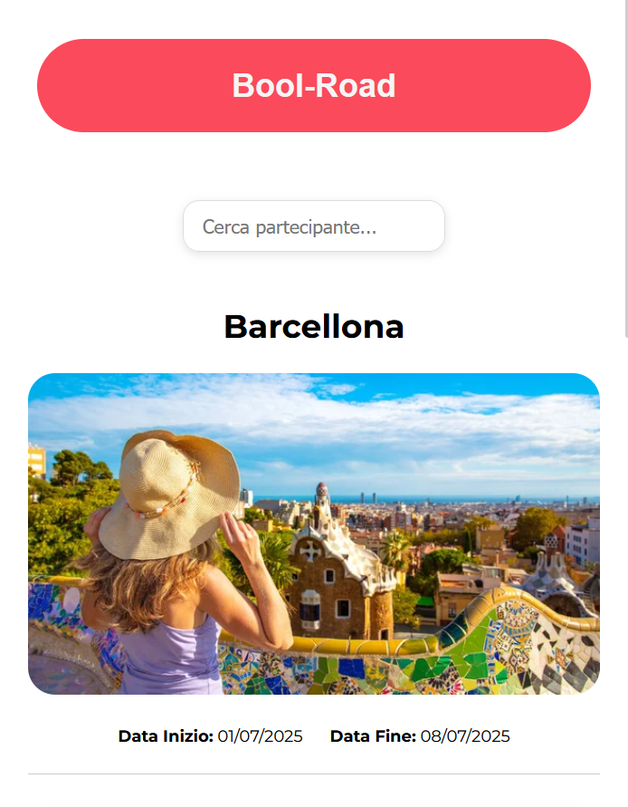
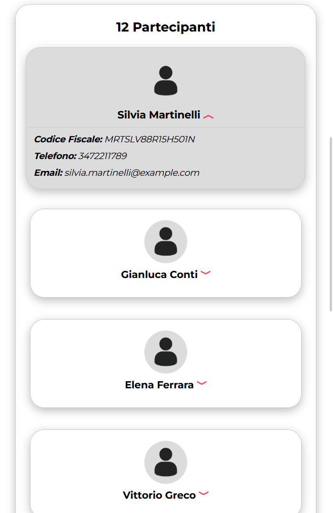
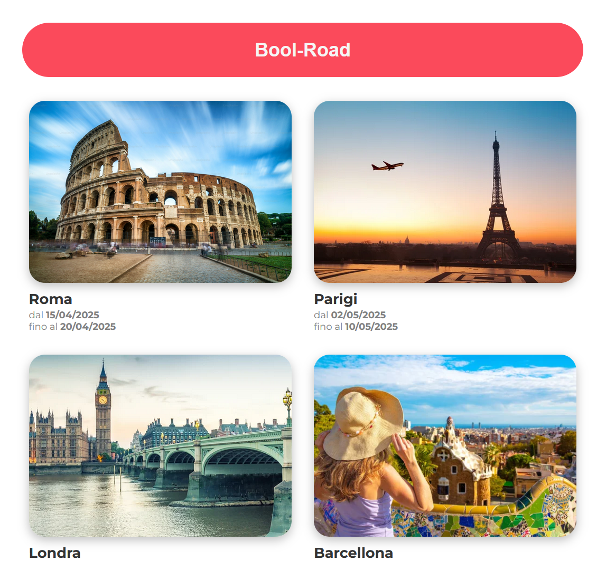
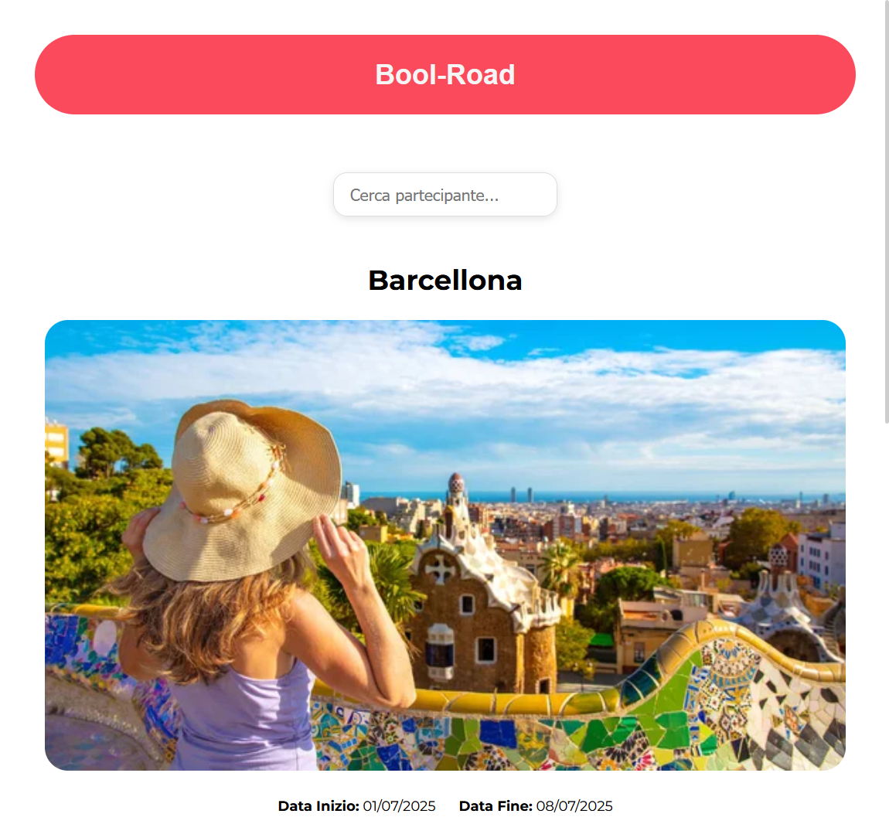
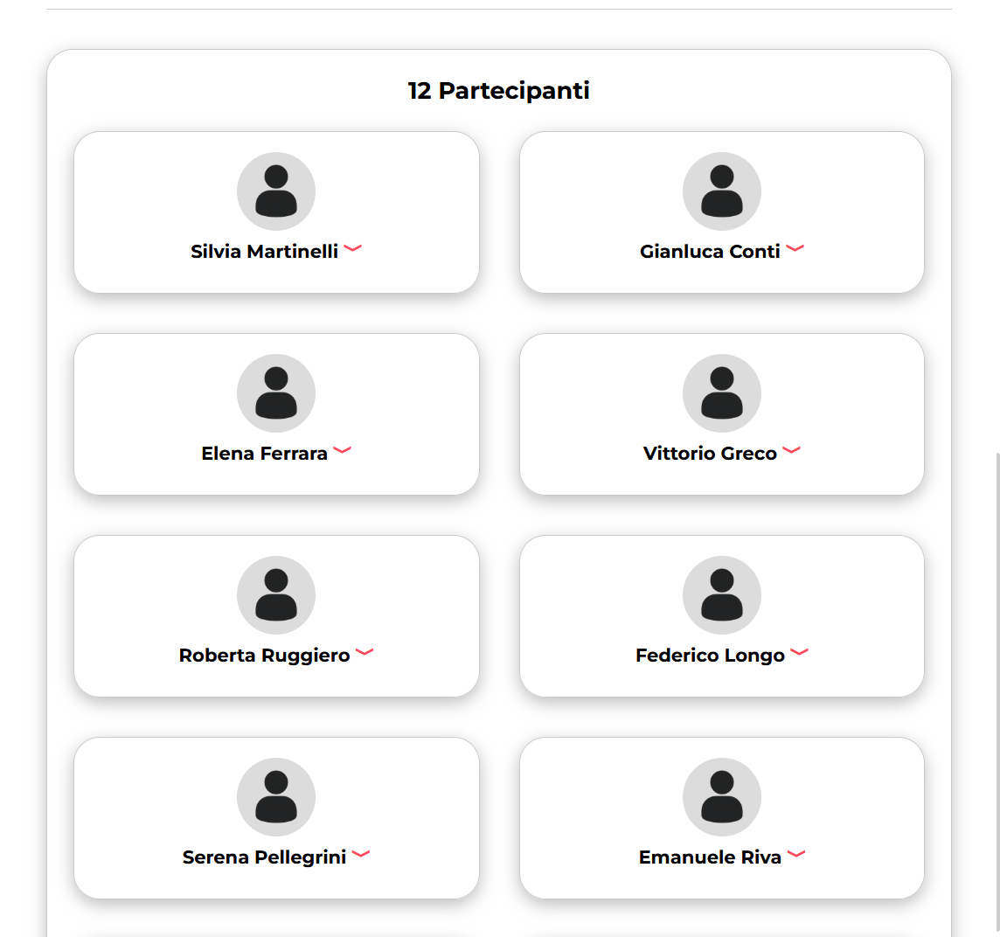
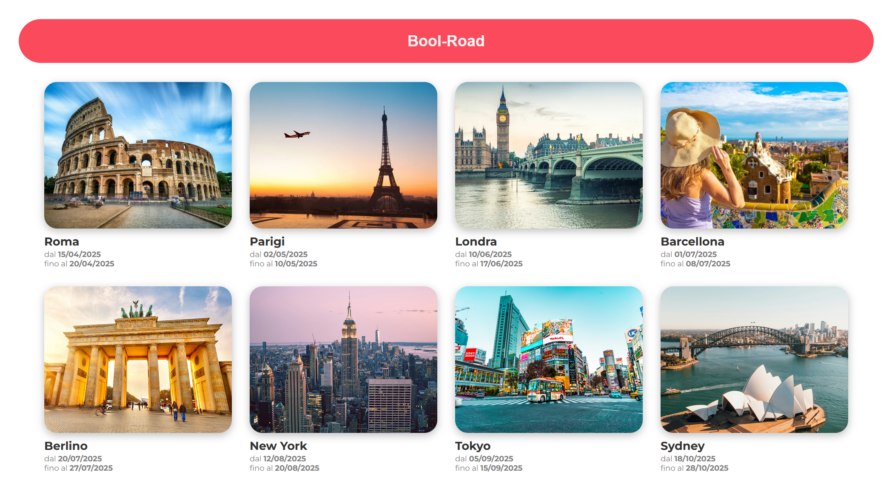
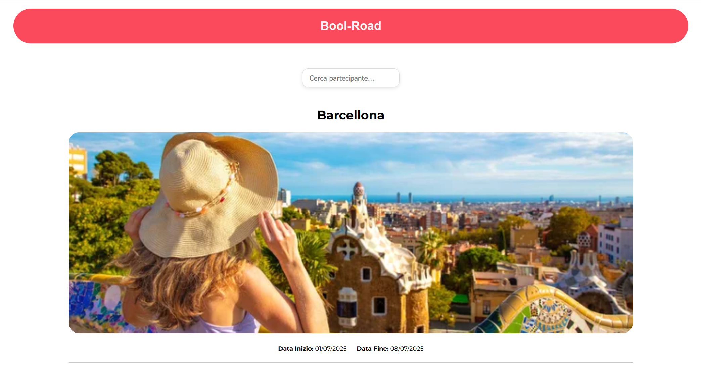
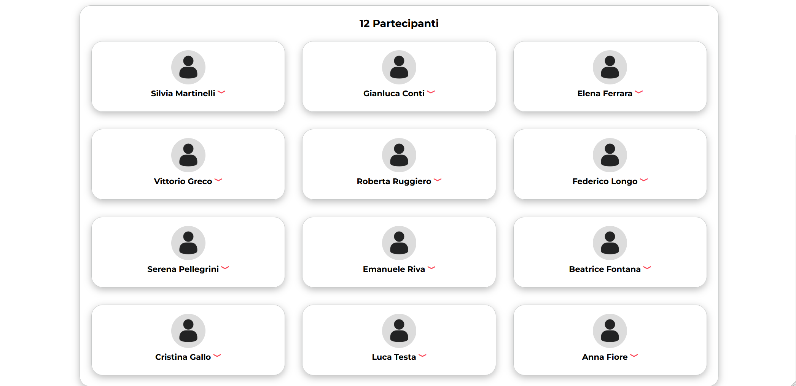

  

<h1 align="center">Bool-Road</h1>

  Web application per la consultazione dei viaggi e dei contatti dei partecipanti.

---

## Descrizione

**Bool-Road** è una web application progettata per semplificare la gestione operativa dei viaggi di gruppo.  
L’app consente di consultare l’elenco dei viaggi e di accedere rapidamente ai contatti dei partecipanti, rendendo più immediata la comunicazione durante le attività organizzative.

Il progetto è stato sviluppato con particolare attenzione alla **chiarezza dell’interfaccia** e alla **leggibilità delle informazioni**, così da risultare efficace anche in contesti dinamici o in mobilità.

Le scelte di design privilegiano:
- accesso rapido ai dati essenziali
- interfaccia essenziale e intuitiva
- utilizzo fluido da smartphone
- layout responsive adattabile a tablet e desktop

---

## Anteprima

### Mobile - HomePage

  

### Scheda viaggio

  
   
  

### Tablet

  

### Scheda viaggio

  
   
  

### Desktop

---

## Tecnologie utilizzate

- Vite
- React
- JavaScript
- CSS3
